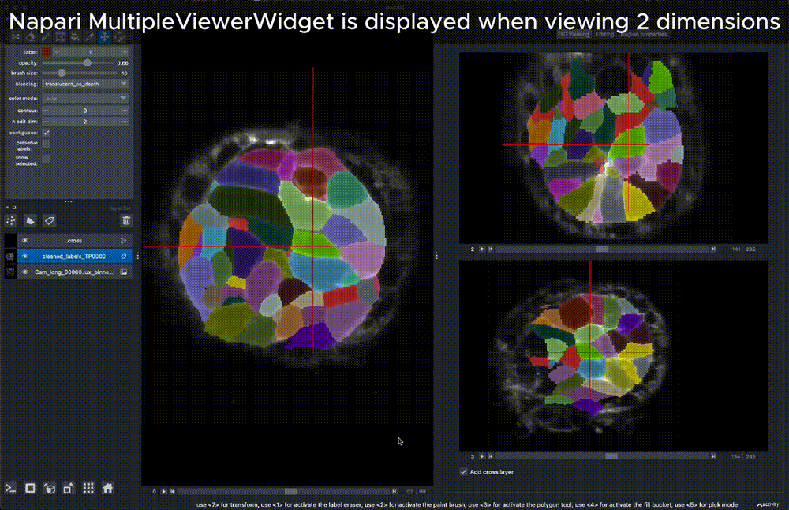
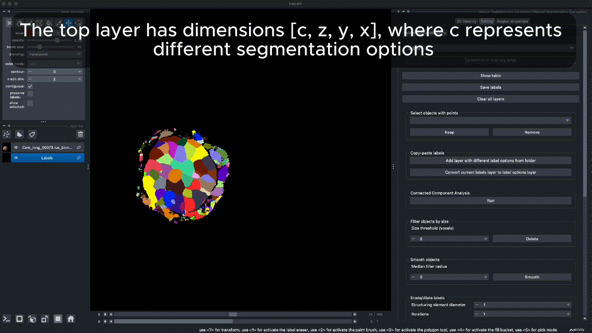
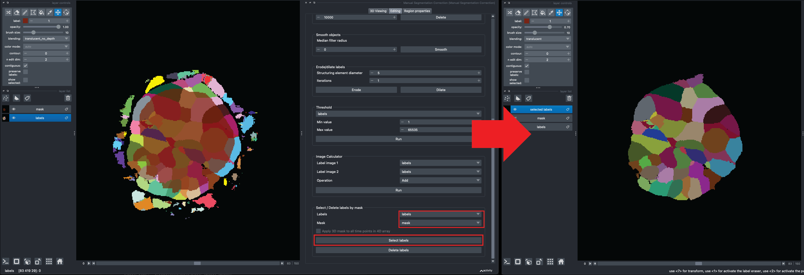

# napari-segmentation-correction

Toolbox for viewing, analyzing and correcting (cell) segmentation in 2D, 3D or 4D (t, z, y, x) (virtual) arrays. 
----------------------------------

This [napari] plugin was generated with [Cookiecutter] using [@napari]'s [cookiecutter-napari-plugin] template.

<!--
Don't miss the full getting started guide to set up your new package:
https://github.com/napari/cookiecutter-napari-plugin#getting-started

and review the napari docs for plugin developers:
https://napari.org/stable/plugins/index.html
-->

## Installation

You can install `napari-segmentation-correction` via [pip]:

To install latest development version :

    pip install git+https://github.com/AnniekStok/napari-segmentation-correction.git

## Usage
This plugin serves as a toolbox aiming to help with correcting segmentation results.
Functionalities:
- Orthogonal views for 3D data based on the [MultipleViewerWidget](https://github.com/napari/napari/blob/e490e5535438ab338a23b17905a1952f15a6d27a/examples/multiple_viewer_widget.py) and 3D plane and clipping plane sliders.
- explore label properties (scikit-image regionprops) in a table widget (based on [napari-skimage-regionprops](https://github.com/haesleinhuepf/napari-skimage-regionprops)) and a Matplotlib plot.
- select/delete labels using a points layer
- copy labels from a 2-5 dimensional array with multiple segmentation options to your current 2-4 dimensional label layer.
- label connected components (scikit-image)
- filter labels by number of pixels
- smooth labels (using a median filter)
- erode/dilate labels (scipy.ndimage and scikit-image)
- binarize an image or labels layer by applying an intensity threshold
- image calculator for mathematical operations on two images
- selecting/deleting labels that overlap with a binary mask

### 3D viewing

### Copy labels between different labels layers

To copy 2D or 3D labels from one layer to another, follow these steps: 
1) Select the labels layer from which you want to copy, and click 'Convert current label layer to label options layer' 
2) Make sure the labels layer to which you want to copy is your new current label layer (clicking on it will activate it, or select it from the dropdown at the top of the Editing tab). 
3) With the layer named 'labels options' selected, Shift+Click on the main view or any of the orthogonal views to copy the label you clicked on to the target layer. Alternatively, right-mouse click will copy only the 2D label from the current view (yx for the main view, xz and yz for the orthogonal views) to the corresponding position in target layer.

### Select / delete labels that overlap with a binary mask

All labels that share any pixel overlap with the mask are selected.

## Contributing

Contributions are very welcome. Tests can be run with [tox], please ensure
the coverage at least stays the same before you submit a pull request.

## License

Distributed under the terms of the [BSD-3] license,
"napari-segmentation-correction" is free and open source software

## Issues

If you encounter any problems, please [file an issue] along with a detailed description.

[napari]: https://github.com/napari/napari
[Cookiecutter]: https://github.com/audreyr/cookiecutter
[@napari]: https://github.com/napari
[MIT]: http://opensource.org/licenses/MIT
[BSD-3]: http://opensource.org/licenses/BSD-3-Clause
[GNU GPL v3.0]: http://www.gnu.org/licenses/gpl-3.0.txt
[GNU LGPL v3.0]: http://www.gnu.org/licenses/lgpl-3.0.txt
[Apache Software License 2.0]: http://www.apache.org/licenses/LICENSE-2.0
[Mozilla Public License 2.0]: https://www.mozilla.org/media/MPL/2.0/index.txt
[cookiecutter-napari-plugin]: https://github.com/napari/cookiecutter-napari-plugin

[file an issue]: https://github.com/AnniekStok/napari-segmentation-correction/issues

[napari]: https://github.com/napari/napari
[tox]: https://tox.readthedocs.io/en/latest/
[pip]: https://pypi.org/project/pip/
[PyPI]: https://pypi.org/
